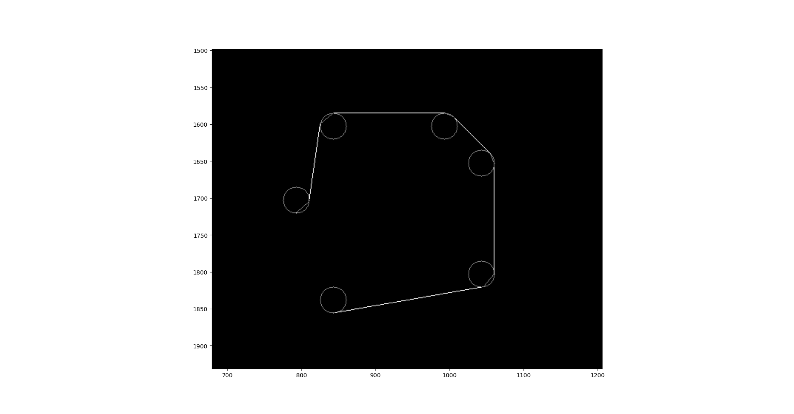

# Title 1
## Title 2
### Title 3

Table 1. Foo

| column 1 | column 2 |
| --- | --- |
| Греческие буквы | αερτϒηξλωΩβμ |
| Греческие буквы через маркдаун | \alpha, \Alpha, \beta, \Beta, \gamma, \Gamma, \pi, \Pi, \phi, \varphi, \mu, \Phi |
| Formula | $x^2*\sqrt{3}/2$ |
| Formula | $\frac{1}{2}$ |
| Picture |  |

Table 2. Fooo

| Left-aligned | Center-aligned | Right-aligned |
| :---         |     :---:      |          ---: |
| git status   | git status     | git status    |
| git diff     | git diff       | git diff      |


Picture 1 -- Bar

> aA**A**Aa
> 
> bB**B**Bb

```
x*x + y*y = r*r
2*x + 4*y + 1 = 0
```

**bold** *italic* ***bold-italic***

Spoiler

<details> 
  <summary>Q1: What is the best Language in the World? </summary>
   A1: JavaScript 
</details>

This sentence uses `$` delimiters to show math inline:  $\sqrt{3x-1}+(1+x)^2$

$$\left( \sum_{k=1}^n a_k b_k \right)^2 \leq \left( \sum_{k=1}^n a_k^2 \right) \left( \sum_{k=1}^n b_k^2 \right)$$

